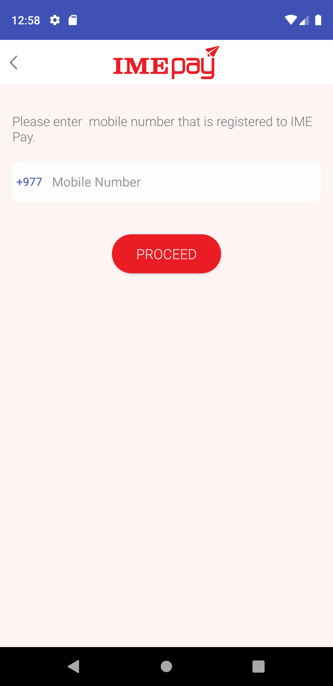

# epayNepal
Bindings for major Payment gateways of Nepal with Xamarin Forms 

## More about Platform
https://docs.microsoft.com/en-us/xamarin/xamarin-forms/

## Currently integrated Payment gateways
1) esewa: https://developer.esewa.com.np/#/android
2) IME Pay: https://github.com/imepay/imepaySDK_android
3) Khalti: https://docs.khalti.com/checkout/android/

## Available Platforms
Xamarin Android 
Xamarin IOS (Coming soon)

## Screenshots
 
 &nbsp;&nbsp;&nbsp;  &nbsp;&nbsp;&nbsp;   

## Preview
 
