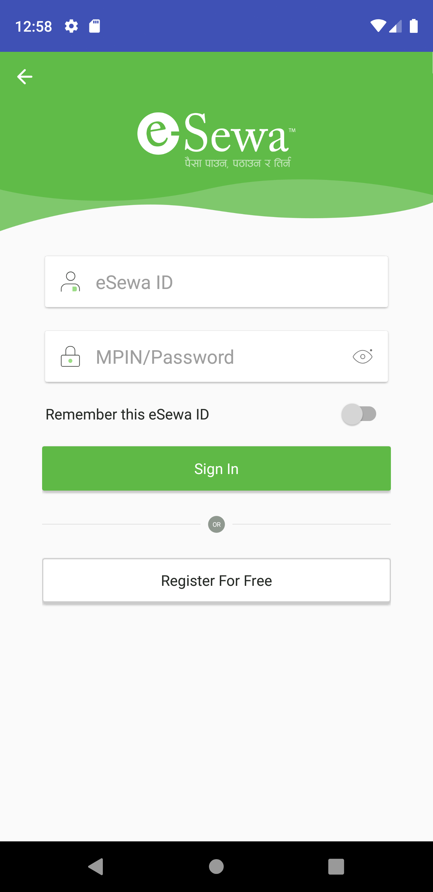
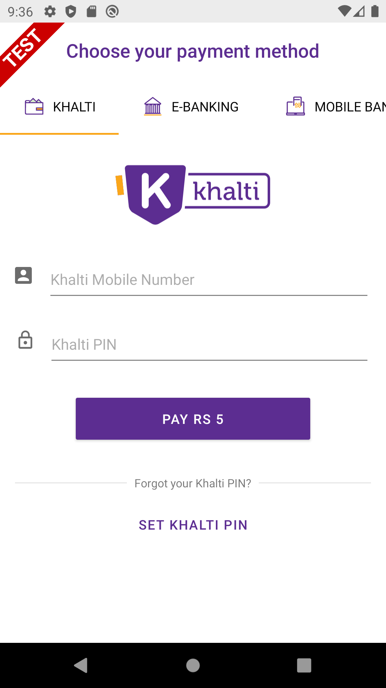

# epayNepal
Native Bindings for major Payment gateways of Nepal with Xamarin Forms (esewa, IME Pay and Khalti) 
These dependencies are based on Xamarin Android bindings. 

## More about Platform
https://docs.microsoft.com/en-us/xamarin/xamarin-forms/

## Official Documentation:
1) esewa: https://developer.esewa.com.np/#/android
2) IME Pay: https://github.com/imepay/imepaySDK_android
3) Khalti: https://docs.khalti.com/checkout/android/

## Xamarin implementation 
* Xamarin Android : Available  
* Xamarin IOS : Coming soon
If you are willing to contribute, don't ask just do it. :)

## Project Binding source code
* Esewa: https://github.com/exendahal/esewaSDK  
* Khalti: https://github.com/exendahal/KhaltiSDK  
* IME Pay: https://github.com/exendahal/ImePaySDK

## Dependencies for Khalti for Xamarin Android
* adapter-rxjava
* appCompactBinding
* converter-gson
* logging-interceptor
* OKHTTP
* picasso
* Retrofit
* ripple
* rxAndroid
* rxBinding
* rxjava
* rxPermission
* GoogleGson (Nuget Package Available)
* quare.OkIO (Nuget Package Available)
* ZhangHai.Android.MaterialProgressBar (Nuget Package Available)
* Karamunting.KotlinX.Coroutines.Android (Nuget Package Available)
* Karamunting.KotlinX.Coroutines.Core (Nuget Package Available)
* Xamarin.Kotlin.StdLib (Nuget Package Available)
* Xamarin.AndroidX.MultiDex (Nuget Package Available)
* Xamarin.AndroidX.ViewPager2 (Nuget Package Available)
* Xamarin.Google.Android.Material (Nuget Package Available)

 Refer styles.xml for Android styling  

## Screenshots
 
 &nbsp;&nbsp;&nbsp;  &nbsp;&nbsp;&nbsp;   

## Preview
 

In case of any need, write me at contact@dahalsantosh.com.np 
